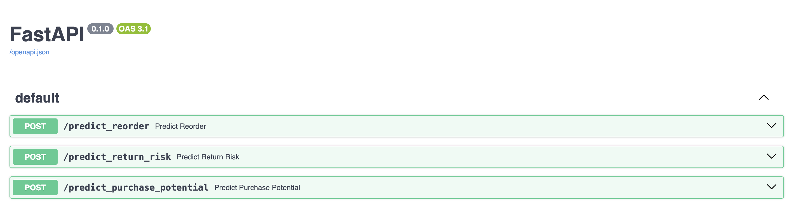
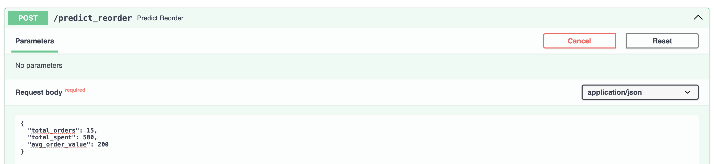
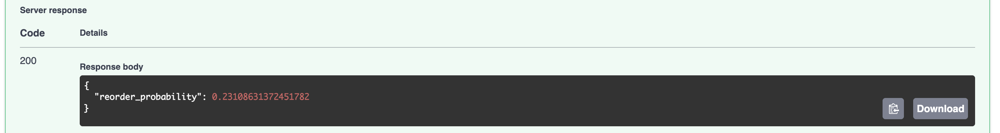
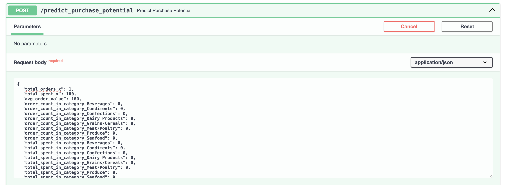
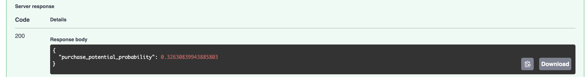
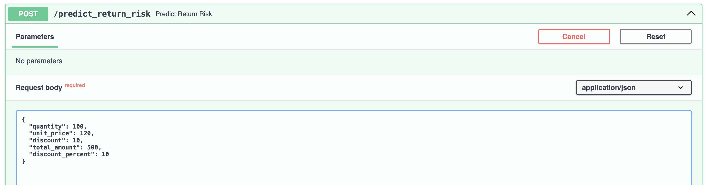
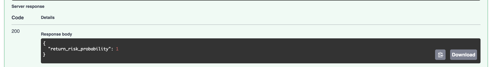

# DeepNorthwind-API

## Proje Amacı
Bu proje, Northwind veritabanı üzerinde makine öğrenmesi modelleri kullanarak müşteri yeniden sipariş tahmini, ürün satın alma potansiyeli tahmini ve iade riski tahmini yapmayı amaçlamaktadır. Bu tahminler, işletmelerin müşteri davranışlarını anlamalarına ve stratejik kararlar almalarına yardımcı olur.

## Proje Geliştiricisi
Bu proje, [SEVGİ BERK SÜTBAŞ](https://github.com/artfuturx) tarafından Turkcell GYK1 projeleri kapsamında geliştirilmiştir.

## Proje Adımları
1. **Veri Hazırlama**: Müşteri, ürün ve iade verilerinden özellik çıkarımı yapılır. Bu adımda, verilerin temizlenmesi, dönüştürülmesi ve özellik mühendisliği yapılır.
2. **Model Eğitimi**: TensorFlow kullanılarak derin öğrenme modelleri eğitilir. Bu modeller, veri seti üzerinde eğitilerek tahmin yapabilir hale getirilir.
3. **API Geliştirme**: FastAPI kullanılarak tahmin yapmak için API endpoint'leri oluşturulur. Bu endpoint'ler, kullanıcıların model tahminlerini alabilmelerini sağlar.

## Detaylı Dosya Yapısı
```
DeepNorthwind-API/
├── data/
│   └── database_connect.py         # Veritabanı bağlantı ayarları ve temel sorgular
│
├── features/                       # Özellik çıkarımı için modüller
│   ├── customer_features.py        # Müşteri özelliklerinin çıkarıldığı modül
│   │                              # - Sipariş geçmişi
│   │                              # - Sipariş sıklığı
│   │                              # - Ortalama sipariş tutarı
│   │
│   ├── product_features.py         # Ürün özelliklerinin çıkarıldığı modül
│   │                              # - Satış geçmişi
│   │                              # - Stok durumu
│   │                              # - Fiyat bilgisi
│   │
│   └── return_features.py          # İade özelliklerinin çıkarıldığı modül
│                                  # - İade geçmişi
│                                  # - Sipariş detayları
│                                  # - Müşteri bilgileri
│
├── models/                         # Model eğitim scriptleri
│   ├── train_customer_reorder.py   # Müşteri yeniden sipariş tahmin modeli
│   │                              # - Derin öğrenme modeli (TensorFlow)
│   │                              # - Feature scaling
│   │                              # - Model kaydetme
│   │
│   ├── train_product_purchase.py   # Ürün satın alma potansiyeli tahmin modeli
│   │                              # - Derin öğrenme modeli (TensorFlow)
│   │                              # - Feature scaling
│   │                              # - Model kaydetme
│   │
│   └── train_return_risk.py        # İade riski tahmin modeli
│                                  # - Derin öğrenme modeli (TensorFlow)
│                                  # - Feature scaling
│                                  # - Model kaydetme
│
├── saved_models/                   # Eğitilmiş modeller ve scaler'lar
│   ├── customer_reorder/          # Müşteri yeniden sipariş modeli dosyaları
│   │   ├── reorder_model.h5       # Eğitilmiş model
│   │   └── scaler.pkl            # Feature scaler
│   │
│   ├── product_purchase/          # Ürün satın alma modeli dosyaları
│   │   ├── product_purchase_model.h5
│   │   └── scaler.pkl
│   │
│   └── return_risk/               # İade riski modeli dosyaları
│       ├── return_risk_model.h5
│       └── scaler.pkl
│
├── images/                         # Görselleştirmeler ve grafikler
│   ├── predict/                   # Tahmin sonuçları 
│   │   ├── predict_all.png       # Tüm tahminlerin endpointleri
│   │   ├── predict_reorder/      # Yeniden sipariş tahmin enpointi
│   │   ├── predict_purchase_potential/
│   │   └── predict_return_risk/
│   │
│   └── analysis/                  # Analiz 
│       └── month_orders.png      # Aylık sipariş analizi
│
├── app.py                         # FastAPI uygulaması ve endpoint'ler
├── requirements.txt               # Proje bağımlılıkları
└── README.md                      # Proje dokümantasyonu
```

## API Endpoint'leri
- **Tüm Tahminler**:
  - 

- **/predict_reorder**: Müşteri yeniden sipariş tahmini yapar. Bu endpoint, müşteri ID'si ve sipariş detayları alarak, müşterinin yeniden sipariş verip vermeyeceğini tahmin eder.
  - 
  - 

- **/product_purchase_potential**: Ürün satın alma potansiyeli tahmini yapar. Bu endpoint, ürün ID'si ve müşteri detayları alarak, ürünün satın alma potansiyelini tahmin eder.
  - 
  - 

- **/predict_return_risk**: İade riski tahmini yapar. Bu endpoint, sipariş detayları alarak, iade riskini tahmin eder.
  - 
  - 

## Kurulum ve Çalıştırma
1. Projeyi klonlayın:
```bash
git clone https://github.com/artfuturx/DeepNorthwind-API.git
cd DeepNorthwind-API
```

2. Sanal ortam oluşturun ve bağımlılıkları yükleyin:
```bash
python -m venv venv
source venv/bin/activate  # Linux/Mac
venv\Scripts\activate     # Windows
pip install -r requirements.txt
```

3. Veritabanı bağlantısını ayarlayın:
- PostgreSQL veritabanınızı oluşturun
- `data/database_connect.py` dosyasındaki bağlantı bilgilerini güncelleyin

4. API'yi çalıştırın:
```bash
uvicorn app:app --reload
```

> **Not:** Eğer Apple Silicon (M1/M2) işlemcili bir Mac kullanıyorsanız, TensorFlow ve bazı kütüphanelerin yüklenmesi için ek adımlar veya uyumlu sürümler gerekebilir. Detaylar için [official TensorFlow Apple Silicon guide](https://developer.apple.com/metal/tensorflow-plugin/) adresine bakabilirsiniz.

## API Dokümantasyonu (Swagger)
API'yi çalıştırdıktan sonra, otomatik olarak oluşturulan Swagger arayüzüne aşağıdaki adresten ulaşabilirsiniz:

- [http://localhost:8000/docs](http://localhost:8000/docs)

## Kullanılan Teknolojiler
- **FastAPI**: Web API framework'ü
- **TensorFlow**: Derin öğrenme modelleri için
- **PostgreSQL**: Veritabanı
- **Pandas & NumPy**: Veri manipülasyonu
- **Scikit-learn**: Feature scaling ve model değerlendirme

